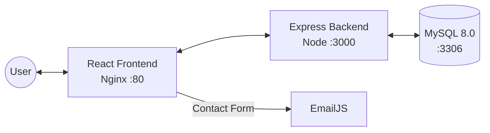

# Jerry's Chaska — Full-Stack Food Ordering & Service Management

Jerry's Chaska is a professional food ordering application designed for authentic street food delivery. It features a modern, high-contrast dark-mode UI with real-time cart management, user ratings, and integrated customer support.

## 🚀 Quick Start

**⚠️ IMPORTANT**: See [`SETUP.md`](./SETUP.md) for complete setup instructions!

```bash
# Start with Docker (Recommended)
docker-compose up -d
```

Access:

- Frontend: http://localhost:5173
- Admin Panel: http://localhost:8080
- API Server: http://localhost:5000/api

**📋 Documentation**:

- [`SETUP.md`](./SETUP.md) - Complete setup guide
- [`MIGRATION.md`](./MIGRATION.md) - Recent changes explained
- [`TROUBLESHOOTING.md`](./TROUBLESHOOTING.md) - Quick solutions
- [`CHANGES.md`](./CHANGES.md) - Detailed changelog

## 🚀 Tech Stack

- **Frontend**: React 18, Tailwind CSS (Custom Dark Theme), Lucide Icons, Axios
- **Backend**: Node.js, Express.js, Mongoose
- **Database**: MongoDB 7 (Document storage)
- **Containerisation**: Docker & Docker Compose
- **Authentication**: JWT + bcrypt

## 🏗️ High-Level Architecture



In Kubernetes each box above runs as a **Deployment** fronted by a **Service**. Containers communicate via Kubernetes Service DNS names (e.g. `jerrys-backend`, `jerrys-mysql`), **not** `localhost`.

## 📂 Project Structure

```text
project-root/
├── frontend/                 # React Single Page Application
│   ├── Dockerfile            # Multi-stage build: Node 20 → Nginx Alpine
│   ├── nginx.conf            # SPA-aware Nginx configuration
│   ├── .dockerignore
│   ├── src/
│   │   ├── components/       # Reusable UI (FoodCard, RatingModal, etc.)
│   │   ├── pages/            # Route-level views (Home, Menu, Ratings)
│   │   ├── services/         # API / Mock clients (api.js, ratingsService.js)
│   │   ├── context/          # State management (Auth, Cart)
│   │   └── App.jsx           # Routing & Entry
│   └── package.json
├── backend/                  # RESTful API Server
│   ├── Dockerfile            # Node 20 Alpine, production deps only
│   ├── .dockerignore
│   ├── src/
│   │   ├── controllers/      # Request handlers & Logic
│   │   ├── routes/           # API endpoint definitions
│   │   ├── models/           # Database schemas & Queries
│   │   ├── config/           # database.js (reads env vars)
│   │   ├── middleware/       # Auth & Security layers
│   │   └── app.js            # Server entry point
│   └── package.json
├── mysql/                    # MySQL database (educational custom image)
│   ├── Dockerfile            # mysql:8.0 + init script
│   └── init.sql              # Schema bootstrap & seed data
└── README.md                 # ← You are here
```

## 📜 Key Responsibilities

| Feature               | Primary Component / File                                                     |
| :-------------------- | :--------------------------------------------------------------------------- |
| **Authentication**    | `frontend/src/context/AuthContext.jsx` & `backend/src/routes/auth.js`        |
| **Menu Management**   | `frontend/src/pages/Menu.jsx` & `backend/src/controllers/menuController.js`  |
| **Ratings & Reviews** | `frontend/src/services/ratingsService.js` & `frontend/src/pages/Ratings.jsx` |
| **Cart Logic**        | `frontend/src/context/CartContext.jsx` (Local Persistence)                   |
| **Contact Form**      | `frontend/src/pages/Contact.jsx` (Integrated with EmailJS)                   |

## 🔗 API Endpoints

| Method | Path                 | Description                |
| :----- | :------------------- | :------------------------- |
| `GET`  | `/api/menu`          | Fetch all food items       |
| `POST` | `/api/auth/register` | Register a new user        |
| `POST` | `/api/auth/login`    | Authenticate & receive JWT |
| `POST` | `/api/orders`        | Place a new order          |
| `GET`  | `/health`            | Backend health check       |

---

## 🐳 Docker Images

Each service has its own Dockerfile. **Docker Compose is intentionally not used** because Kubernetes is the target runtime.

### Build Commands

```bash
# Frontend — React app served by Nginx
docker build -t <registry>/jerrys-frontend:1.0 ./frontend

# Backend — Node.js Express API
docker build -t <registry>/jerrys-backend:1.0 ./backend

# MySQL — Custom image with init script (educational)
docker build -t <registry>/jerrys-mysql:1.0 ./mysql
```

> Replace `<registry>` with your container registry (e.g. `docker.io/myuser`, `ghcr.io/myorg`, or a private registry).

### Image Details

| Image             | Base             | Exposed Port | Size (approx.) |
| :---------------- | :--------------- | :----------: | :------------: |
| `jerrys-frontend` | `nginx:alpine`   |      80      |     ~25 MB     |
| `jerrys-backend`  | `node:20-alpine` |     3000     |    ~120 MB     |
| `jerrys-mysql`    | `mysql:8.0`      |     3306     |    ~550 MB     |

### Frontend Build Args

The frontend API URL is baked in at build time (Vite replaces `import.meta.env` during the build). Pass it as a build argument:

```bash
docker build \
  --build-arg VITE_API_URL=http://jerrys-backend:3000/api \
  -t <registry>/jerrys-frontend:1.0 \
  ./frontend
```

---

## ☸️ Kubernetes Deployment

### Prerequisites

- A running Kubernetes cluster (minikube, kind, EKS, GKE, AKS, etc.)
- `kubectl` configured to talk to the cluster
- Images pushed to a registry accessible by the cluster

### 1. Create a Namespace

```bash
kubectl create namespace jerrys-chaska
```

### 2. Create Secrets

Store sensitive values in a Kubernetes Secret:

```bash
kubectl create secret generic jerrys-secrets \
  --namespace jerrys-chaska \
  --from-literal=MYSQL_ROOT_PASSWORD=supersecretpassword \
  --from-literal=DB_PASSWORD=supersecretpassword \
  --from-literal=JWT_SECRET=my-jwt-secret-key-change-in-prod
```

### 3. Deploy MySQL

```yaml
# mysql-deployment.yaml
apiVersion: apps/v1
kind: Deployment
metadata:
  name: jerrys-mysql
  namespace: jerrys-chaska
spec:
  replicas: 1
  selector:
    matchLabels:
      app: jerrys-mysql
  template:
    metadata:
      labels:
        app: jerrys-mysql
    spec:
      containers:
        - name: mysql
          image: <registry>/jerrys-mysql:1.0
          ports:
            - containerPort: 3306
          env:
            - name: MYSQL_ROOT_PASSWORD
              valueFrom:
                secretKeyRef:
                  name: jerrys-secrets
                  key: MYSQL_ROOT_PASSWORD
            - name: MYSQL_DATABASE
              value: jerrys_chaska
          volumeMounts:
            - name: mysql-data
              mountPath: /var/lib/mysql
      volumes:
        - name: mysql-data
          persistentVolumeClaim:
            claimName: mysql-pvc
---
apiVersion: v1
kind: Service
metadata:
  name: jerrys-mysql
  namespace: jerrys-chaska
spec:
  selector:
    app: jerrys-mysql
  ports:
    - port: 3306
      targetPort: 3306
  clusterIP: None # Headless service for stable DNS
```

### 4. Deploy Backend

```yaml
# backend-deployment.yaml
apiVersion: apps/v1
kind: Deployment
metadata:
  name: jerrys-backend
  namespace: jerrys-chaska
spec:
  replicas: 2
  selector:
    matchLabels:
      app: jerrys-backend
  template:
    metadata:
      labels:
        app: jerrys-backend
    spec:
      containers:
        - name: backend
          image: <registry>/jerrys-backend:1.0
          ports:
            - containerPort: 3000
          env:
            - name: NODE_ENV
              value: production
            - name: PORT
              value: "3000"
            - name: DB_HOST
              value: jerrys-mysql # ← Kubernetes Service DNS name
            - name: DB_PORT
              value: "3306"
            - name: DB_USER
              value: root
            - name: DB_NAME
              value: jerrys_chaska
            - name: DB_PASSWORD
              valueFrom:
                secretKeyRef:
                  name: jerrys-secrets
                  key: DB_PASSWORD
            - name: JWT_SECRET
              valueFrom:
                secretKeyRef:
                  name: jerrys-secrets
                  key: JWT_SECRET
            - name: FRONTEND_URL
              value: "*" # Or the Ingress URL
          readinessProbe:
            httpGet:
              path: /health
              port: 3000
            initialDelaySeconds: 10
            periodSeconds: 5
          livenessProbe:
            httpGet:
              path: /health
              port: 3000
            initialDelaySeconds: 15
            periodSeconds: 10
---
apiVersion: v1
kind: Service
metadata:
  name: jerrys-backend
  namespace: jerrys-chaska
spec:
  selector:
    app: jerrys-backend
  ports:
    - port: 3000
      targetPort: 3000
```

### 5. Deploy Frontend

```yaml
# frontend-deployment.yaml
apiVersion: apps/v1
kind: Deployment
metadata:
  name: jerrys-frontend
  namespace: jerrys-chaska
spec:
  replicas: 2
  selector:
    matchLabels:
      app: jerrys-frontend
  template:
    metadata:
      labels:
        app: jerrys-frontend
    spec:
      containers:
        - name: frontend
          image: <registry>/jerrys-frontend:1.0
          ports:
            - containerPort: 80
          readinessProbe:
            httpGet:
              path: /
              port: 80
            initialDelaySeconds: 5
            periodSeconds: 5
---
apiVersion: v1
kind: Service
metadata:
  name: jerrys-frontend
  namespace: jerrys-chaska
spec:
  selector:
    app: jerrys-frontend
  ports:
    - port: 80
      targetPort: 80
  type: LoadBalancer # Or NodePort / ClusterIP behind an Ingress
```

### 6. Apply Manifests

```bash
kubectl apply -f mysql-deployment.yaml
kubectl apply -f backend-deployment.yaml
kubectl apply -f frontend-deployment.yaml
```

### Service Communication Flow

```
┌──────────────┐       ┌──────────────────┐       ┌──────────────┐
│   Frontend   │──────▶│     Backend      │──────▶│    MySQL     │
│  (Nginx:80)  │ HTTP  │ (Express:3000)   │  TCP  │   (:3306)    │
│              │       │                  │       │              │
│ jerrys-      │       │ jerrys-          │       │ jerrys-      │
│ frontend     │       │ backend          │       │ mysql        │
└──────────────┘       └──────────────────┘       └──────────────┘
     ▲                                                    │
     │  Users access via                    PersistentVolume
     │  LoadBalancer / Ingress              for data durability
```

- **Frontend → Backend**: The React app calls `VITE_API_URL` (baked at build time) which resolves to the `jerrys-backend` Service.
- **Backend → MySQL**: The Express app connects to `DB_HOST=jerrys-mysql` which resolves via Kubernetes DNS to the MySQL Service.

---

## 🛠️ Local Development Setup

### Frontend

```bash
cd frontend
npm install
# Configure .env with EmailJS keys and API URL
npm run dev
```

### Backend

```bash
cd backend
npm install
# Configure .env with DB credentials (DB_HOST=localhost for local dev)
npm start
```

### MySQL (Local)

Use a local MySQL server or run the official image:

```bash
docker run -d \
  --name jerrys-mysql-local \
  -e MYSQL_ROOT_PASSWORD=rootpass \
  -e MYSQL_DATABASE=jerrys_chaska \
  -p 3306:3306 \
  -v $(pwd)/mysql/init.sql:/docker-entrypoint-initdb.d/init.sql \
  mysql:8.0
```

---

## ⚠️ Important Notes

- **No Docker Compose**: This project targets Kubernetes as the runtime. Docker Compose is intentionally not included.
- **No secrets in images**: All credentials (DB passwords, JWT secrets) are injected via Kubernetes Secrets at runtime.
- **No localhost for inter-service communication**: In Kubernetes, services communicate via Service DNS names (`jerrys-backend`, `jerrys-mysql`).
- **Frontend API URL is a build-time variable**: Since Vite embeds environment variables at build time, `VITE_API_URL` must be passed as a `--build-arg` when building the frontend image.

## 🚢 DevOps Readiness

- **Docker**: Separate Dockerfiles for frontend, backend, and MySQL — each producing a production-ready image.
- **Kubernetes**: Deployments + Services for all three tiers with health checks, secrets management, and persistent storage.
- **CI/CD**: Structured for integration with Jenkins, GitHub Actions + ArgoCD, or any container-native CI/CD pipeline.
